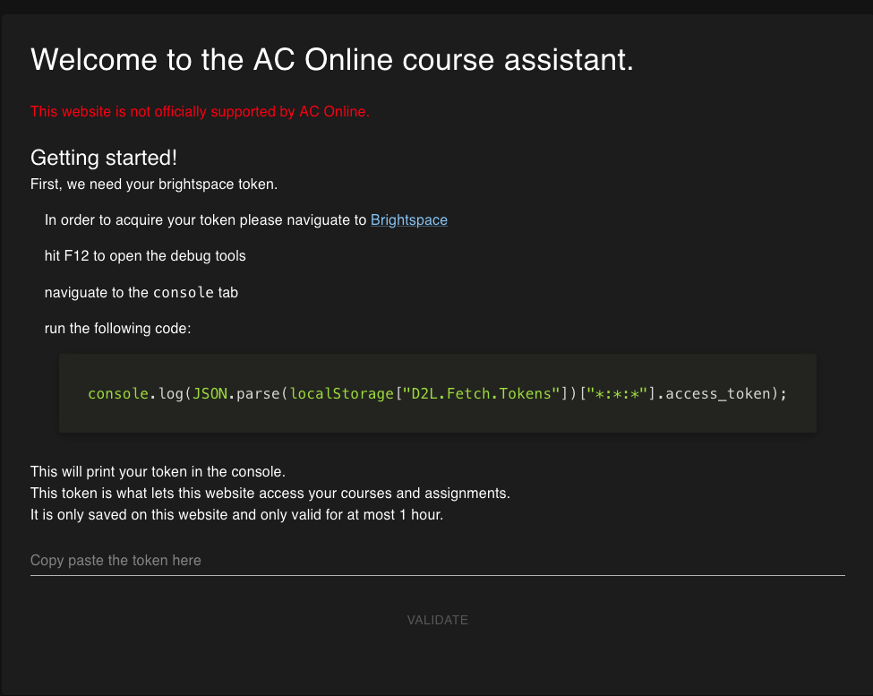
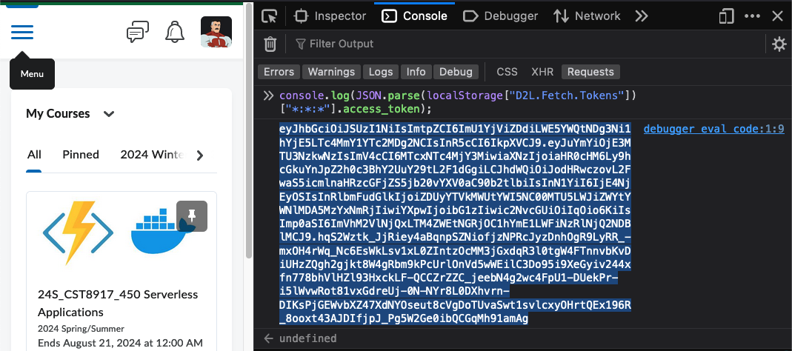
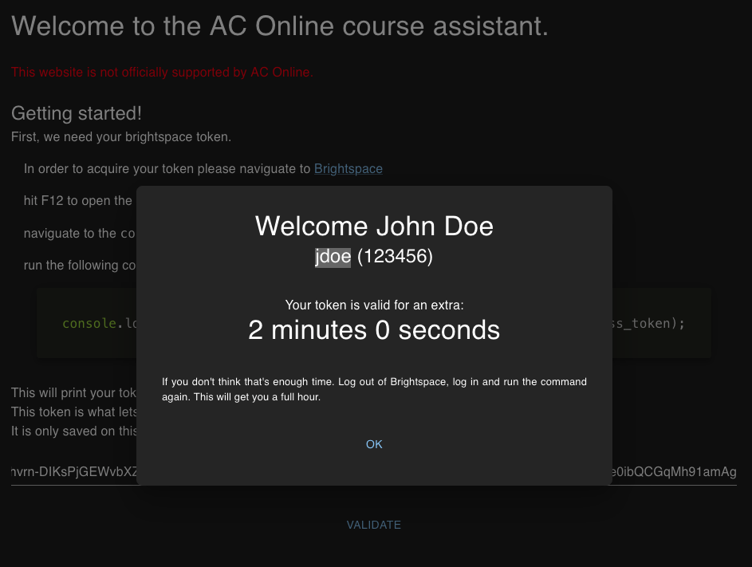
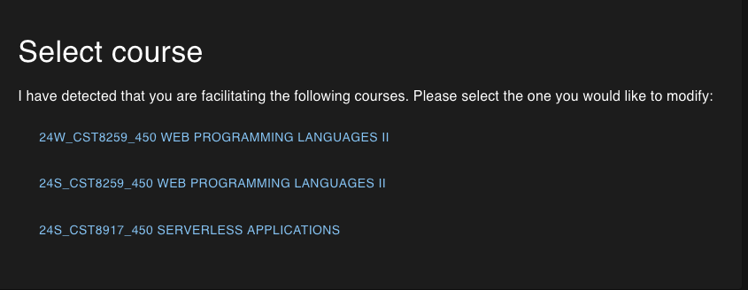
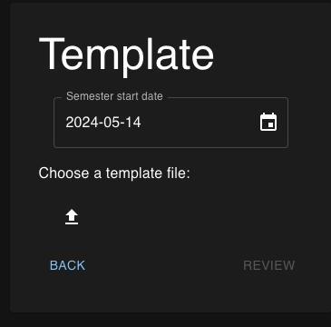
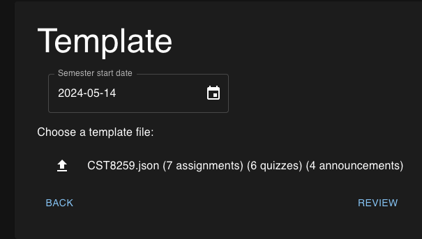
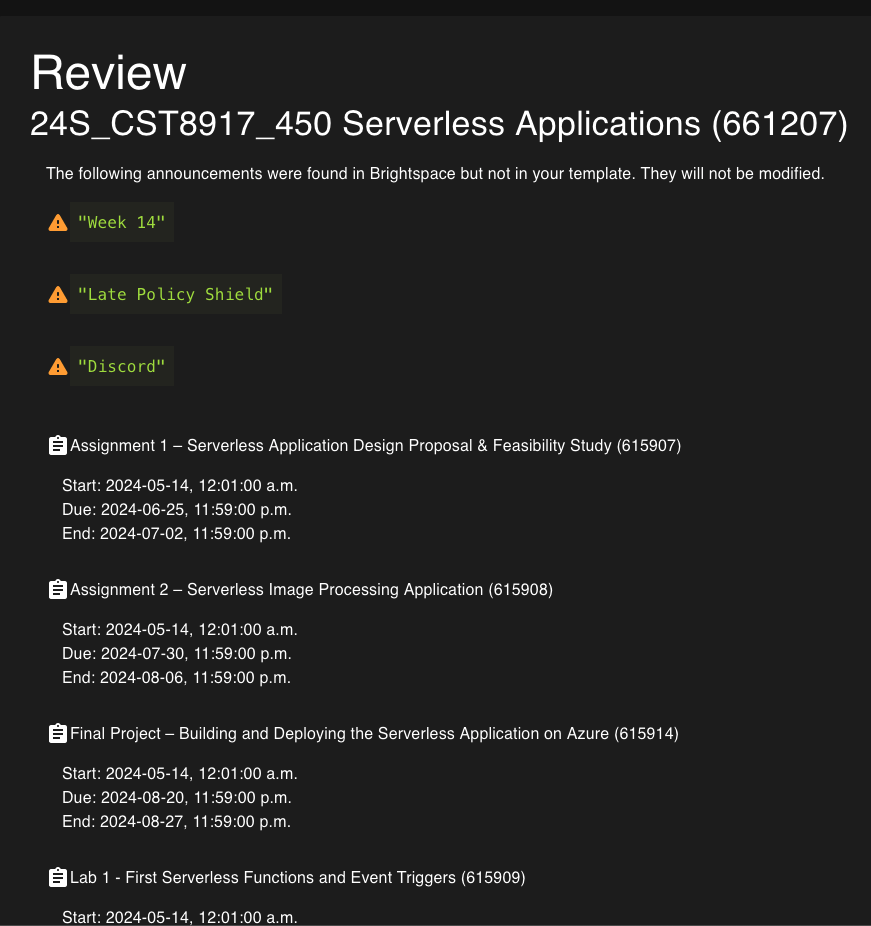

## ACO assistant

Website to help setup start/due/end dates for classes in ACO.
It can be accessed [here](https://an-algonquin-facilitator.github.io/assistant/)

## Usage

### Login page

In the "login" page you'll be asked to get a token from brightspace. We have to do it this way because there's no oficial support for what we want to do. It does look super sketchy but that's all I can do.

First step is we'll do what it says on the website, copy that piece of code, go on brightspace, open the console, paste the code, and finally copy the token (triple click works best).

Then we paste the token in the text field on the login screen and click validate. This will double check that you did it right and that the following steps will work.

Next we select which class we want to setup.

Then we enter the semester start date and the template
See [this document](./template.md) for documentation on how to create a class template.

Then we'll be presented with a preview of the semester

After clicking next at the end of the page we will move to the final page, you'll be given one last chance to stop before the website attempts to apply your changes

Readying your plan WILL delete all the current announcements. Because all your announcements should be in your template file.

At the time of writing this documentation I am not setting up any classes so I can't take a picture of the final output. But the website walks you through what it has done and what has failed (if anything).
