# ACO course setup assistant

This will guide you through using the ACO assistant. This tool can setup dates for all assignments, quizzes, and announcements. It can also auto generate content for announcement using a template system that means your announcement dates are always perfect.

## Usage

### Login page

In the "login" page you'll be asked to get a token from brightspace. We have to do it this way because there's no oficial support for what we want to do. It does look super sketchy but that's all I can do.

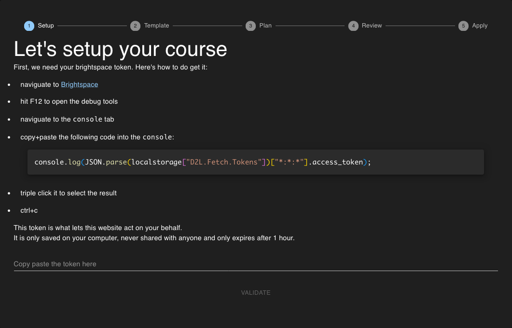

First step is we'll do what it says on the website, copy that piece of code, go on brightspace, open the console, paste the code, and finally copy the token (triple click works best).


Then we paste the token in the text field on the login screen and click validate. This will double check that you did it right and that the following steps will work.

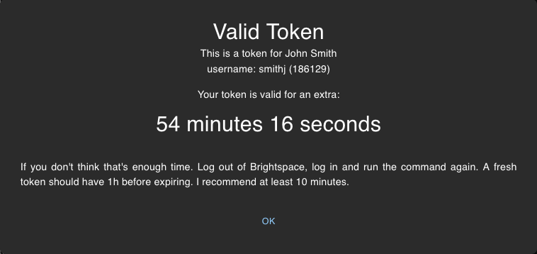

Next we select our template. For more information on how to make those see the [template guide](./TemplateGuide.md)

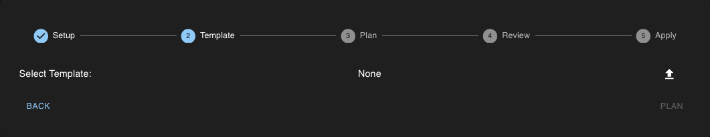

If you upload a template with an invalid format the assistant will not let you proceed and explain what is wrong about the format.

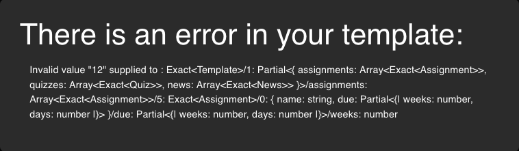

When a valid template is loaded, the assistant will try to automatically select a course. It'll use the courses start dates and your template file class code to make a selection. You'll then be presented with some useful information about the class and the template.

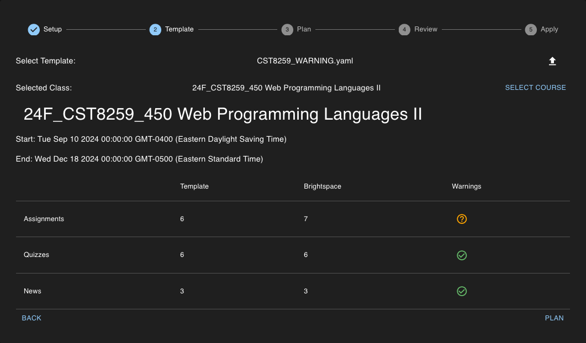

If the assistant did not detect the correct course. Click on `SELECT COURSE` to pick another one.

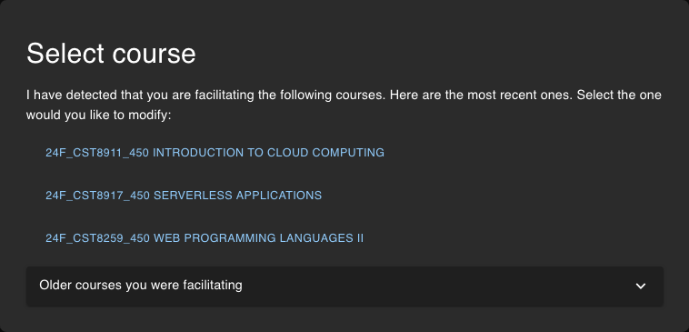

For this example I will am specifically using a template with some warnings, but generally you would want none.

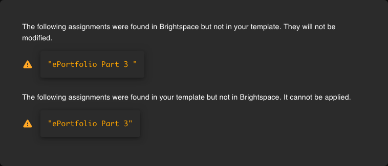

By click on the `?` next to assignments I can see that Brightspace has an extra space in the name of the assignment. I will add a space in my template file because if I fix it in brightspace it'll get reverted next semester and I do not want to talk to the Course Repair Form people if I do not absolutely have to. You can either fix your template and start over or continue. But if you continue with warnings some actions won't be possible.

Once you're satisfied with the template click `PLAN`.

On the plan screen we can see the list of actions the assistant has available for us. As well as a lot of extra info to make sure everything it OK.

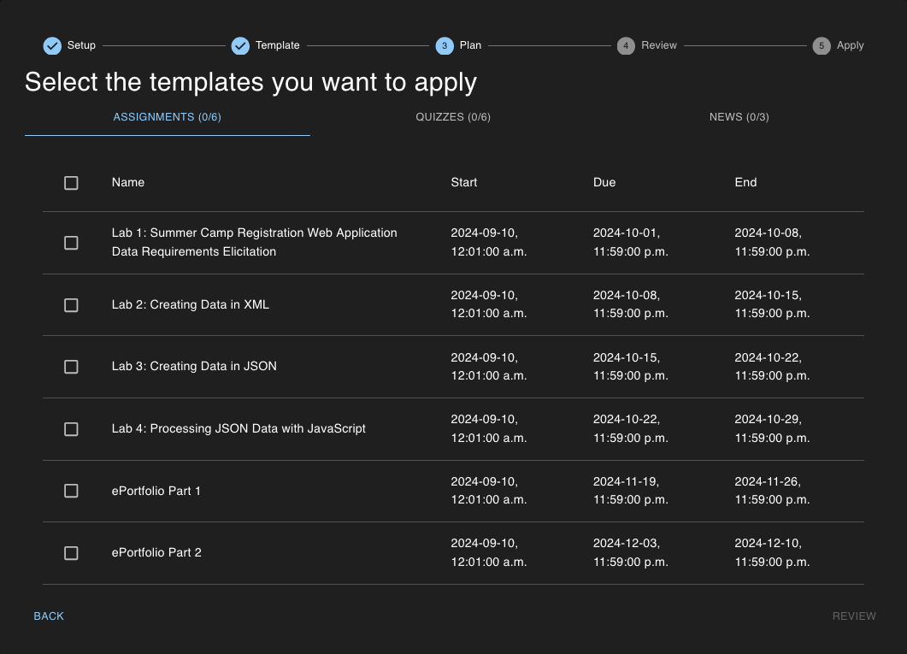

Hover over any date to see how it's calculated

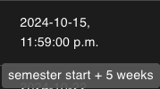

Under News you can even see the rendered content, after the mustache template did it's job. Don't get confused between the brightspace template and the mustache template. The former is for declaring when each assignment and quizzes are due. The Later is used to generate correct dates and data inside announcements.

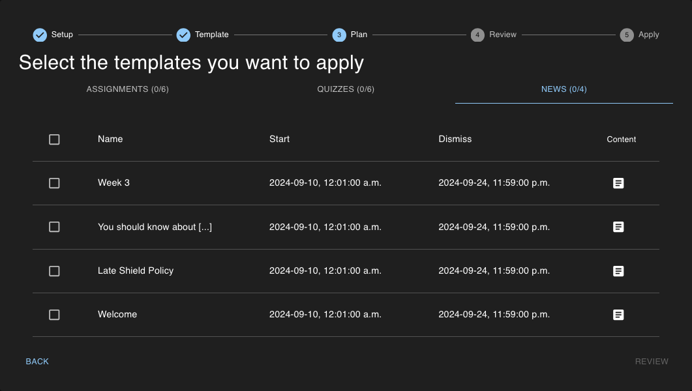
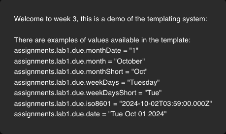

For reference the content of that template is as follows:

```
      Welcome to week 3, this is a demo of the templating system:
      <br><br>
      There are examples of values available in the template:<br>
      assignments.lab1.due.monthDate     = "{{assignments.lab1.due.monthDate}}"<br>
      assignments.lab1.due.month         = "{{assignments.lab1.due.month}}"<br>
      assignments.lab1.due.monthShort    = "{{assignments.lab1.due.monthShort}}"<br>
      assignments.lab1.due.weekDays      = "{{assignments.lab1.due.weekDays}}"<br>
      assignments.lab1.due.weekDaysShort = "{{assignments.lab1.due.weekDaysShort}}"<br>
      assignments.lab1.due.iso8601       = "{{assignments.lab1.due.iso8601}}"<br>
      assignments.lab1.due.date          = "{{assignments.lab1.due.date}}"
```

For this example I will select several of every kind of items but normally I would select everything for everything.
Also if you run the assistant in the middle of the semester make sure you do not attempt to modify any assignment or quiz that already has submissions. Click `REVIEW`.

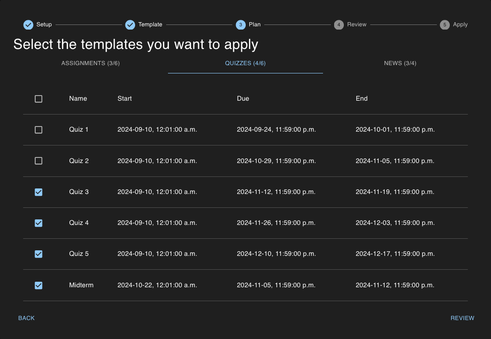

On the review screen we are given another chance to review everything the assistant is planning on doing. We can see everything we saw on the last screen. Click Ready.

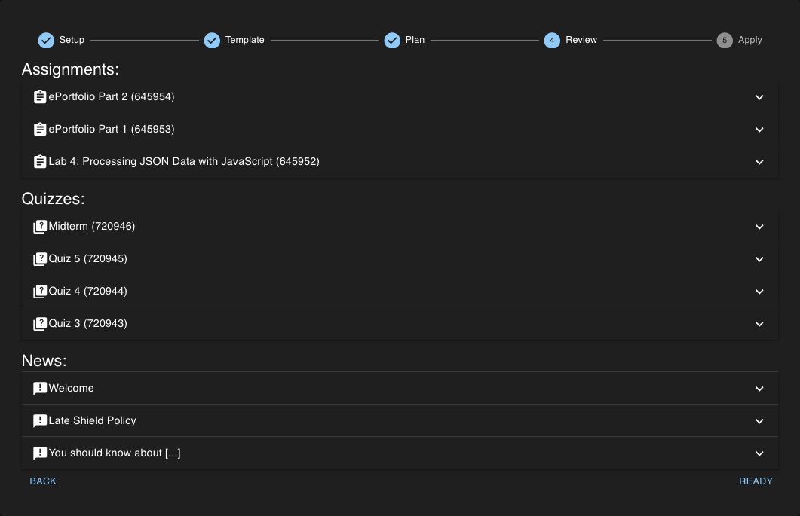

This is the last chance you have to backoff, otherwise the assistant will do it's best to implement your plan.

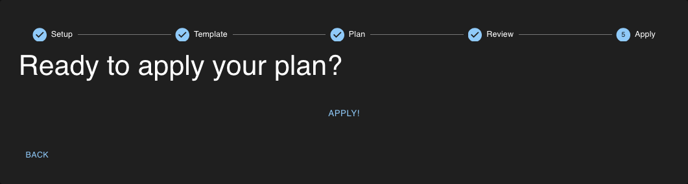

The assistant will now apply every modification you asked for. Giving you feedback on it's progress. This is extremely quick

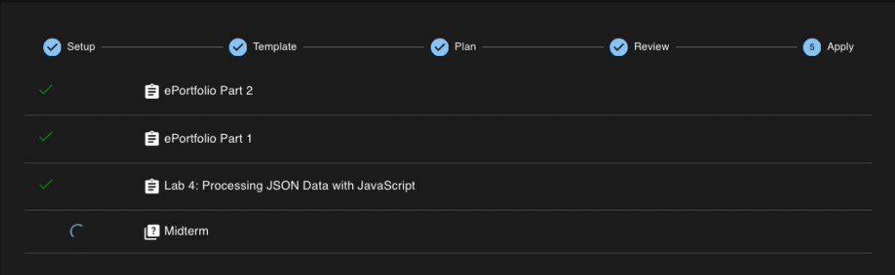

If everything goes well your screen should look like this.

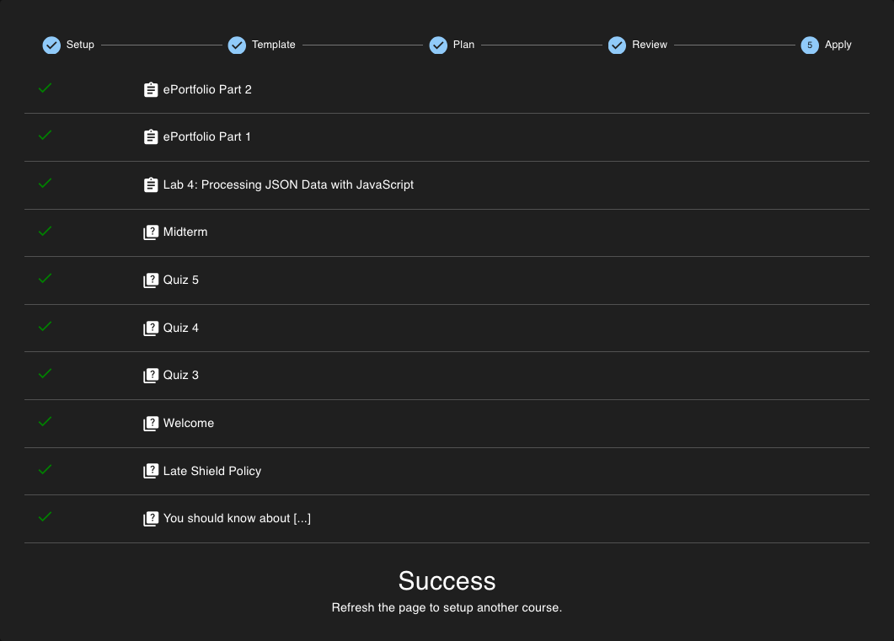

Congrats on setting up your course.
