# ACO course setup assistant

This will guide you through using the ACO assistant. This tool can setup dates for all assignments, quizzes, and announcements. It can also auto generate content for announcement using a template system that means your announcement dates are always perfect.

## Usage

### Login page

In the "login" page you'll be asked to get a token from brightspace. We have to do it this way because there's no oficial support for what we want to do. It does look super sketchy but that's all I can do.

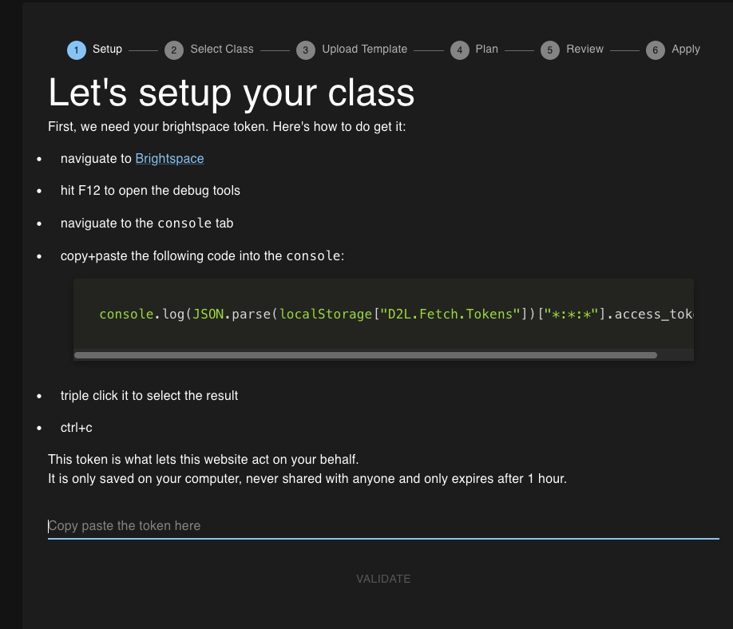

First step is we'll do what it says on the website, copy that piece of code, go on brightspace, open the console, paste the code, and finally copy the token (triple click works best).

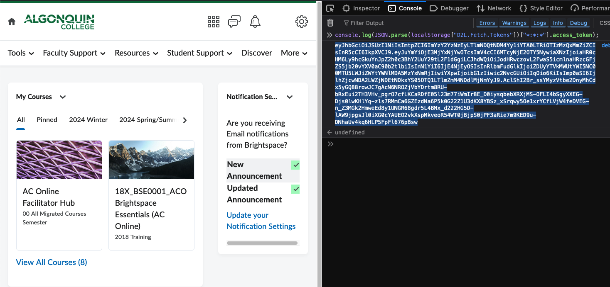

Then we paste the token in the text field on the login screen and click validate. This will double check that you did it right and that the following steps will work.

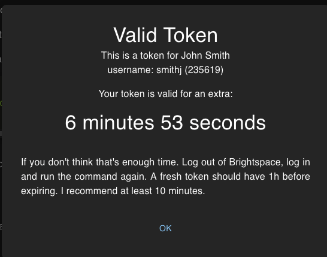

Next we select which course we want to setup.

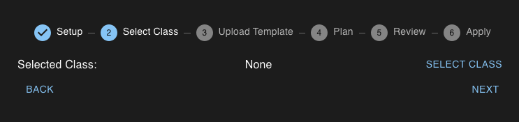

Click on `Select`

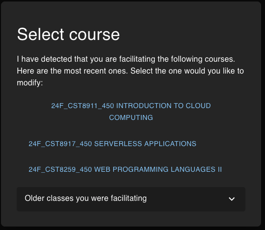

Then pick the course you're setting up. The assistant attempts to figure out which course you're likely to setup but if the course you want isn't in that list click on "Older courses you were facilitating". You can see what kind of content is in the course. Click next.

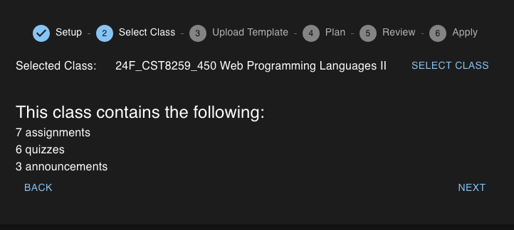

Next were going to upload our course template. For more information on how to make those see the [template guide](./TemplateGuide.md)

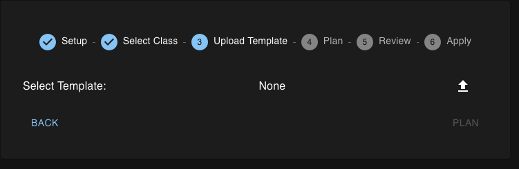

Here I uploaded a template with some mismatches to show what can happen.

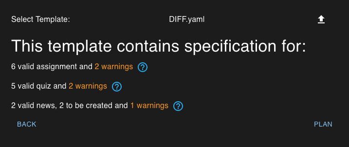

By click on the `?` next to assignments I can see that Brightspace has an extra space in the name of the assignment. I will add a space in my template file because if I fix it in brightspace it'll get reverted next semester and I do not want to talk to the Course Repair Form people if I do not absolutely have to. You can either fix your template and start over or continue. But if you have warnings some actions won't be possible.

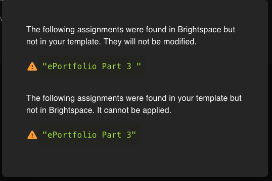

On the plan screen we can see everything the assistant has planned for us. As well as a lot of extra info to make sure everything it OK.

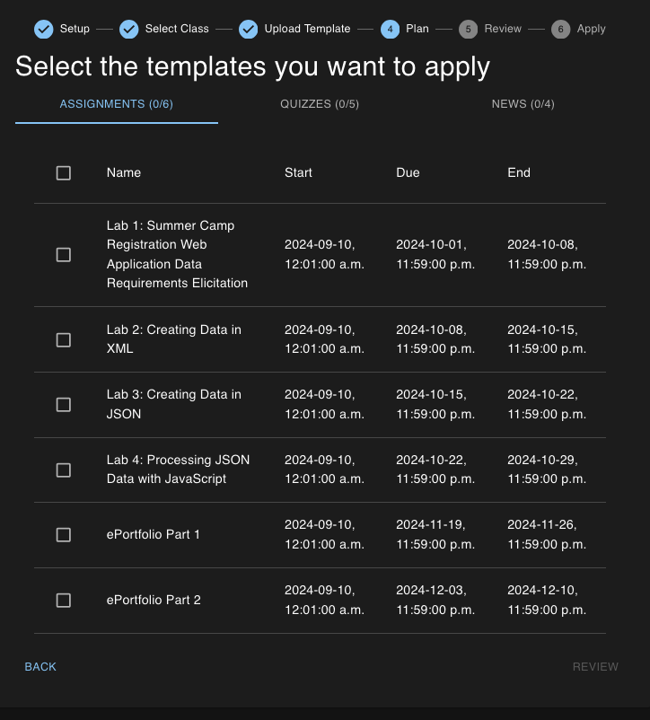

Hover over any date to see how it's calculated

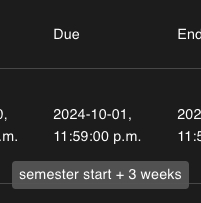

Under News you can even see the rendered content, after the template system did it's job.

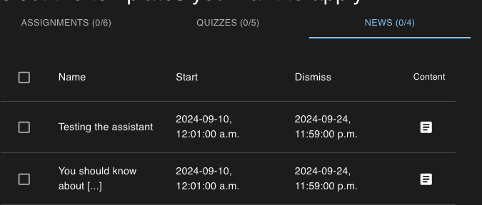

For this example I will select one of each items. Normally I would select everything.
Also if you run the assistant in the middle of the semester. make sure you do not attempt to modify any assignment or quiz that already has submissions. Click Review.

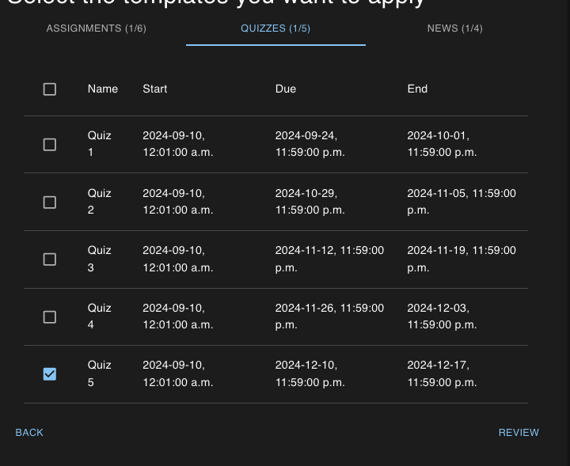

On the review screen we are given another chance to review everything the assistant is planning on doing. We can see everything we saw on the last screen. Click Ready.

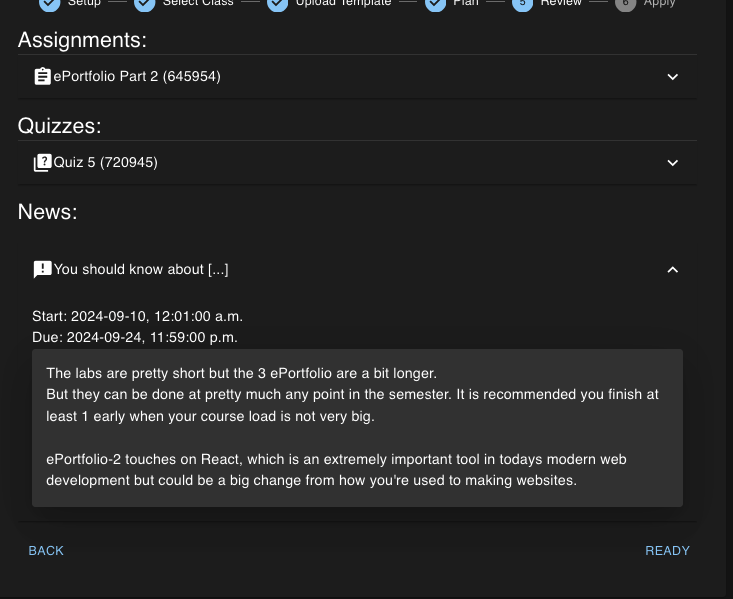

This is the last chance you have to backoff, otherwise the assistant will do it's best to implement your plan.

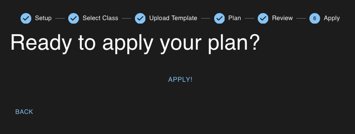

The assistant will not apply every modification you asked for. Giving you feedback on it's progress. This is extremely quick

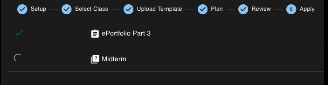

If everything goes well your screen should look like this.

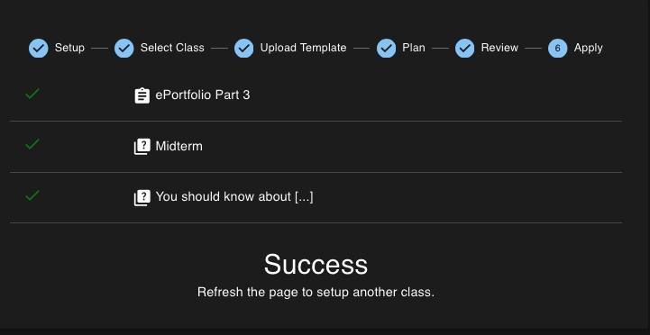

Congrats on setting up your course.
